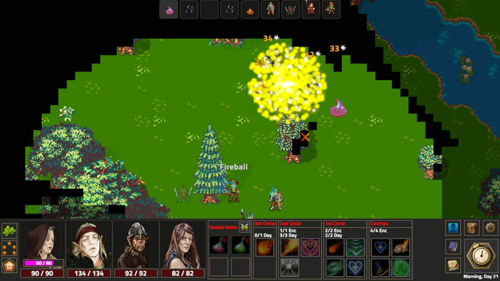

# Sulis
Sulis is a game and game engine written in Rust.  The engine is fairly mature and there are currently several available campaigns to play in the game.

## Standalone Releases
Standalone binary releases are available for Windows and Linux if you are only interested in playing the game.

Please visit https://www.sulisgame.com or check the [Releases page](https://github.com/Grokmoo/sulis/releases).  

## Developers and Modders
Resources for developers and modders are available on a [page on the website](https://www.sulisgame.com/dev-modding).  Currently, this includes docs for the LUA scripting API.

## Building from Source

### Prerequisites
You'll need recent versions of Rust and Cargo installed.  The game will compile on the latest stable version.  [Get Rust](https://www.rust-lang.org/)

### Installation

1. Clone the git repository.
1. `cargo build --release`
1. Run the game with `cargo run --release`
1. On first run, `config.yml` is created in your home directory.  This file may be edited with your preferences.  It is also written to when using the in game options menu, however changes you have made manually should generally be preserved.
1. The Sulis User Folder location:
  * Linux - `$XDG_CONFIG_HOME/.sulis/` (typically `$HOME/.config/.sulis`) 
  * Windows -`$HOME\My Documents\My Games\Sulis`

Note that Running with release mode is recommended.  The compilation process takes several minutes, but load time and performance in game are massively improved over a standard debug build.

## Troubleshooting

If you have issues running the game after upgrading to a new version, try removing your Sulis user data folder (see above).  Save games, characters, and other data are not generally compatible between different major versions.

For other problems, you can [create an issue](https://github.com/Grokmoo/sulis/issues/new).  Please leave as much information as you can, including logs from your sulis user folder /log directory

### Running the editor

1. `cd sulis_editor/`
1. `cargo run --release`

## Built With
* [Serde](https://serde.rs/)
* [Glium](https://github.com/glium/glium)
* [Image](https://github.com/PistonDevelopers/image)
* [rLua](https://github.com/chucklefish/rlua)
* [Flexi Logger](https://github.com/emabee/flexi_logger)

## Authors
* **Jared Stephen** - *Development* - [Grokmoo](https://github.com/Grokmoo)

## Licensing

This project's source code is licensed under the Gnu Public License version 3 - see the [License](docs/GPLv3-LICENSE) file.  This includes, but is not limited to all .rs, .yml, .json, and .lua files.

Many image assets in this project are licensed under the Creative Commons Attribution 3.0 Unported (CC-BY 3.0) or Creative Commons Attribution Unported 4.0 (CC-BY 4.0) Licenses.  To view a copy of these licenses, visit [CC-BY 3.0](http://creativecommons.org/licenses/by/3.0) and [CC-BY 4.0](http://creativecommons.org/licenses/by/4.0).

Please note that some art assets are proprietary and may only be used and distributed as part of Sulis.

To view attribution and licensing information for each specific file used, please see the [Attribution Sheet](docs/attribution.csv).
